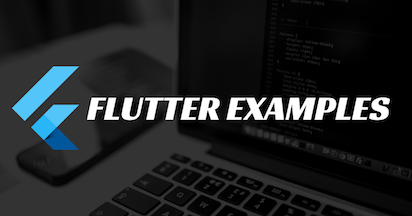

This repository containing links of all the example apps demonstrating features/functionality/integrations in [Flutter](https://flutter.io/) application development.

# Pull Requests

I welcome and encourage all pull requests. It usually will take me within 24-48 hours to respond to any issue or request. Here are some basic rules to follow to ensure timely addition of your request:

1.  Match the document style as closely as possible.
2.  Please keep PR titles easy to read and descriptive of changes, this will make them easier to merge :)
3.  Pull requests _must_ be made against `master` branch for this particular repository.
4.  Check for existing [issues](https://github.com/rauljurado620/FlutterExampleApps/issues) first, before filing an issue.
5.  Make sure you follow the set standard as all other projects in this repo do
6.  Have fun!

## Getting Started

For help getting started with Flutter, view our online
[documentation](http://flutter.io/).

For help editing plugin code, view the [documentation](https://flutter.io/platform-plugins/#edit-code).
